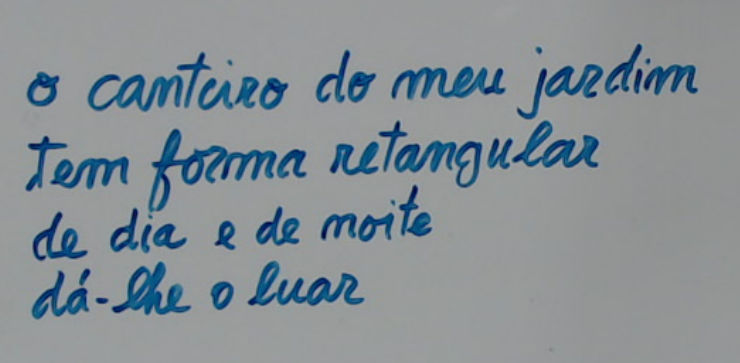

# Canteiro retangular

## Objecto 

{width=12em}

## O que é isto?

Uma vez a minha filha (teria uns 7 anos) apareceu em casa com um
papel minúsculo e olhava com grande cuidado para ele.

-- O que tens aí? \
-- É uma poesia.  \
-- ? \
-- A professora Rosalina escreveu no quadro um problema:
"O canteiro do meu jardim, tem forma retangular. ..."
e eu achei que parecia uma poesia.

E efectivamente escreveu no papelito:\
"O canteiro do meu jardim \
tem forma retangular \
de dia e de noite \
dá-lhe o luar."

-- E a professora? \
-- Disse que é importante saber encontrar a poesia. \

Parece-me que, ao contrário da versão oficial, aprendemos muito mais 
com os nossos filhos do que o inverso. Mesmo quando eles são pequenos.

Já me esqueci de toneladas de coisas,
mas quando menos espero vem-me à lembrança a importância 
de procurar poesia escondida. E às vezes outras coisas 
escondidas.

